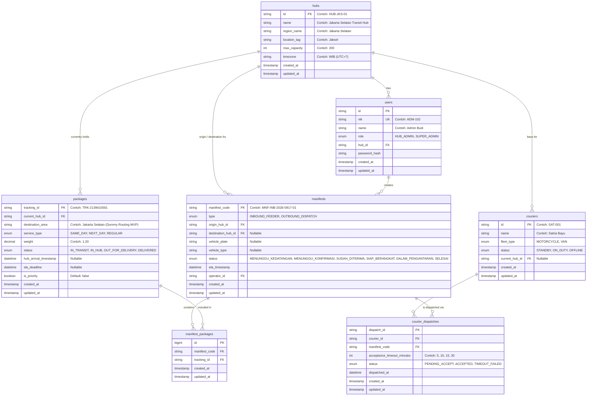

# Entity Relationship Diagram (ERD) - Anteraja Hub

```mermaid
erDiagram
    %% Hubs Relationships
    hubs ||--o{ users : "has"
    hubs ||--o{ couriers : "base for"
    hubs ||--o{ manifests : "origin / destination for"
    hubs ||--o{ packages : "currently holds"

    %% Users & Couriers Relationships
    users ||--o{ manifests : "creates"
    couriers ||--o{ courier_dispatches : "assigned to"

    %% Manifests & Packages Relationships
    manifests ||--o{ manifest_packages : "contains"
    packages ||--o{ manifest_packages : "included in"
    manifests ||--o{ courier_dispatches : "is dispatched via"

    %% Table Definitions
    hubs {
        string id PK "Contoh: HUB-JKS-01"
        string name "Contoh: Jakarta Selatan Transit Hub"
        string region_name "Contoh: Jakarta Selatan"
        string location_tag "Contoh: Jaksel"
        int max_capacity "Contoh: 200"
        string timezone "Contoh: WIB (UTC+7)"
        timestamp created_at
        timestamp updated_at
    }

    users {
        string id PK
        string nik UK "Contoh: ADM-102"
        string name "Contoh: Admin Budi"
        enum role "HUB_ADMIN, SUPER_ADMIN"
        string hub_id FK
        string password_hash
        timestamp created_at
        timestamp updated_at
    }

    couriers {
        string id PK "Contoh: SAT-001"
        string name "Contoh: Satria Bayu"
        enum fleet_type "MOTORCYCLE, VAN"
        enum status "STANDBY, ON_DUTY, OFFLINE"
        string current_hub_id FK "Nullable"
        timestamp created_at
        timestamp updated_at
    }

    manifests {
        string manifest_code PK "Contoh: MNF-INB-2026-0917-01"
        enum type "INBOUND_FEEDER, OUTBOUND_DISPATCH"
        string origin_hub_id FK
        string destination_hub_id FK "Nullable"
        string vehicle_plate "Nullable"
        string vehicle_type "Nullable"
        enum status "MENUNGGU_KEDATANGAN, MENUNGGU_KONFIRMASI, SUDAH_DITERIMA, SIAP_BERANGKAT, DALAM_PENGANTARAN, SELESAI"
        datetime eta_timestamp
        string operator_id FK
        timestamp created_at
        timestamp updated_at
    }

    packages {
        string tracking_id PK "Contoh: TRK-2139410001"
        string current_hub_id FK
        string destination_area "Contoh: Jakarta Selatan (Dummy Routing MVP)"
        enum service_type "SAME_DAY, NEXT_DAY, REGULAR"
        decimal weight "Contoh: 1.20"
        enum status "IN_TRANSIT, IN_HUB, OUT_FOR_DELIVERY, DELIVERED"
        datetime hub_arrival_timestamp "Nullable"
        datetime sla_deadline "Nullable"
        boolean is_priority "Default: false"
        timestamp created_at
        timestamp updated_at
    }

    manifest_packages {
        bigint id PK
        string manifest_code FK
        string tracking_id FK
        timestamp created_at
        timestamp updated_at
    }

    courier_dispatches {
        string dispatch_id PK
        string courier_id FK
        string manifest_code FK
        int acceptance_timeout_minutes "Contoh: 5, 10, 15, 30"
        enum status "PENDING_ACCEPT, ACCEPTED, TIMEOUT_FAILED"
        datetime dispatched_at
        timestamp created_at
        timestamp updated_at
    }
```
