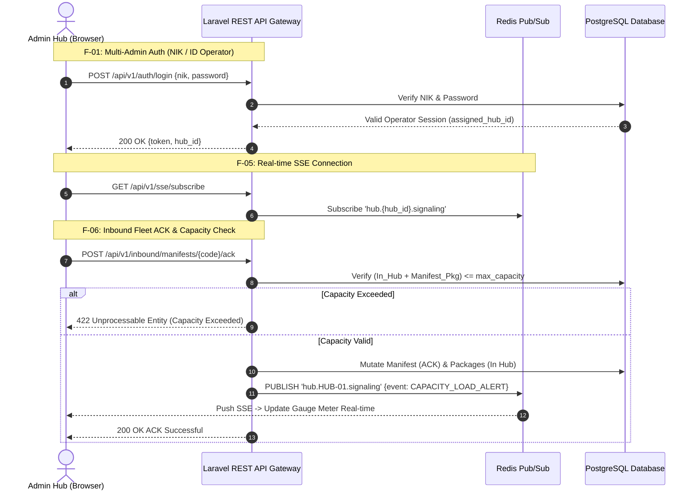

# 🛠️ Master Functional Requirements Document (FRD) v3.5
## Courier Admin Mini-Panel: Functional Architecture & System Specs
> **System Scope:** Phase 1 MVP (6 Core Modules)  
> **Tech Stack:** React.js + Tailwind CSS (Frontend) + Laravel REST API (Backend) + PostgreSQL + Redis + SSE  
> **Document Status:** `APPROVED FOR ENGINEERING`

---

## 📋 Daftar Fitur Fungsional Phase 1 MVP (6 Core Modules)

1. **`F-01` Autentikasi NIK / ID Operator & Penguncian Sesi Multi-Hub**: Login menggunakan NIK / ID Operator + Password dengan akun pre-setup (seeded). Mengunci sesi ke `assigned_hub_id`.
2. **`F-02` Manifest Data Generator**: Bulk simulator engine penyerapan data masif, penentuan otomatis jenis armada (Auto-Vehicle Determination), draf `MNF-YYMM-XXXX`, dan transactional insert `in_transit`.
3. **`F-03` Dynamic SLA Queue Table & Dashboard Operations**: Dashboard agregator dual-metrik, pengurutan antrean dinamis berbasis Priority Flag & SLA Remaining, visual 3 warna (Merah/Kuning/Hijau), dan Quick Release Handover Kurir Satria.
4. **`F-04` Outbound Dispatch Action & Fleet Management**: Manajemen manifes keluar (`OUTBOUND_DISPATCH`), pencatatan armada Kurir Satria *Standby*, dan aksi "Berangkatkan" sebagai pemicu pelepasan kapasitas fisik Hub.
5. **`F-05` Event-Driven Real-Time SSE Signaling Engine**: Bus signaling real-time yang memancarkan 3 event utama (`INBOUND_ARRIVAL_SIGNAL`, `CAPACITY_LOAD_ALERT`, `SLA_BREACH_WARNING`) via Redis Pub/Sub & StreamedResponse SSE.
6. **`F-06` Inbound Sorting & Fleet Acknowledgment (ACK)**: Konfirmasi manifes masuk, kalkulasi batas kapasitas fisik (Rigid Capacity Check), mutasi status bulk paket menjadi `In Hub`, serta kalkulasi timestamp SLA.

---

## 🔔 Spesifikasi 3 Event Utama SSE Signaling (Modul F-05)

### 1. Event: `INBOUND_ARRIVAL_SIGNAL`
* **Trigger**: Eksekusi *Manifest Data Generator* (F-02) saat bulk insert / manifes baru dijadwalkan masuk.
* **Target UI**: Halaman *Inbound Sorting* (F-06) & Sidebar Menu.
* **Payload JSON**:
  ```json
  {
    "event": "INBOUND_ARRIVAL_SIGNAL",
    "data": {
      "new_trucks_count": 1,
      "hub_id": "HUB-JKS-01",
      "manifest_code": "MNF-2609-0012",
      "message": "Truk Baru Tiba di Hub. Segera periksa daftar manifest."
    }
  }
  ```
* **Reaksi UI**: Widget *"Truk Pengirim Masuk"* di F-06 bertambah +1. Toast Notification: *"Truk Baru Tiba di Hub. Segera periksa daftar manifest."*

### 2. Event: `CAPACITY_LOAD_ALERT`
* **Trigger**: Saat truk di-ACK (diterima) di F-06 (menambah beban In Hub) ATAU kurir Diberangkatkan di F-04 (mengurangi beban In Hub).
* **Target UI**: Halaman *SLA Queue Dashboard* (F-03) ➔ Widget *Capacity Load Gauge Meter*.
* **Payload JSON**:
  ```json
  {
    "event": "CAPACITY_LOAD_ALERT",
    "data": {
      "current_load": 180,
      "max_capacity": 200,
      "capacity_percentage": 90.0,
      "status": "WARNING",
      "hub_id": "HUB-JKS-01",
      "message": "Kapasitas Hub mencapai 90%."
    }
  }
  ```
* **Reaksi UI**: Gauge Meter di dashboard bergerak secara *real-time* (naik/turun). Jika >90%, kotak *Capacity Warning Alert* otomatis muncul.

### 3. Event: `SLA_BREACH_WARNING`
* **Trigger**: *Background CronJob / Scheduler* mendeteksi paket dengan sisa waktu < 30 menit (`remaining_minutes < 30`, status Merah / Critical).
* **Target UI**: Sidebar Menu & Halaman *SLA Queue* (F-03).
* **Payload JSON**:
  ```json
  {
    "event": "SLA_BREACH_WARNING",
    "data": {
      "critical_packages_count": 24,
      "hub_id": "HUB-JKS-01",
      "message": "Ada paket baru yang kritis. Segera Refresh Live Queue."
    }
  }
  ```
* **Reaksi UI**: Angka *badge* merah di menu Sidebar berubah (misal dari 20 ke 24). Tombol pemberitahuan *"Ada paket baru yang kritis. Segera Refresh Live Queue"* muncul di atas tabel SLA.

---

## 🛠️ Integrated System Sequence Diagram


