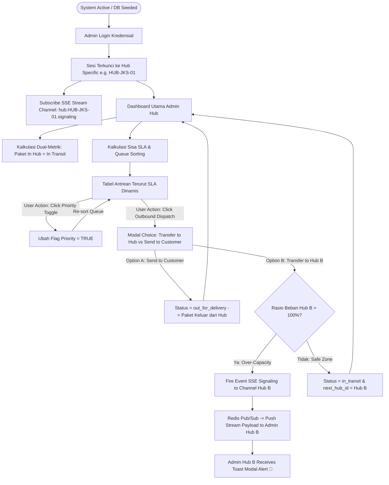
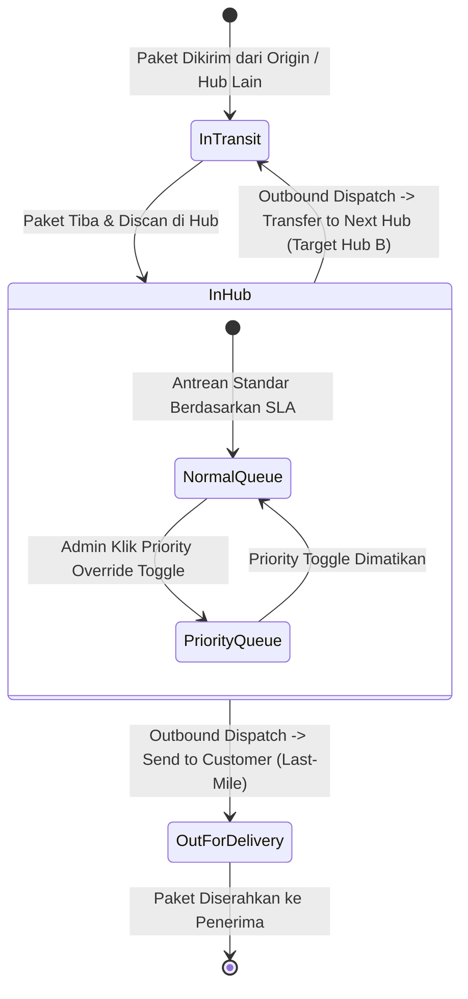

# 🛠️ Master Functional Requirements Document (FRD)
## Courier Admin Mini-Panel: Functional Architecture & System Specs
> **System Scope:** Phase 1 MVP (5 Core Features - 2-Month Execution Roadmap)  
> **Architecture Pattern:** Event-Driven Mid-Mile SLA & Capacity Signaling System  
> **Tech Stack:** React.js + Laravel REST API Gateway + PostgreSQL + Redis + Server-Sent Events (SSE)  
> **Document Version:** `v3.1 (GitHub & Best-Practice Standard - Clean Logic)`  

---

## 📋 Table of Contents
1. [Ringkasan Eksekutif & Arsitektur Modul](#1-ringkasan-eksekutif--arsitektur-modul)
2. [Peran & Hak Akses (Role & Permission Matrix)](#2-peran--hak-akses-role--permission-matrix)
3. [Alur Sistem Terintegrasi (Integrated Flowchart Diagram)](#3-alur-sistem-terintegrasi-integrated-flowchart-diagram)
4. [Pernyataan Alur Kebutuhan Sistem (System Flow Scenarios)](#4-pernyataan-alur-kebutuhan-sistem-system-flow-scenarios)
5. [Aturan Bisnis Global (Global Business Rules)](#5-aturan-bisnis-global-global-business-rules)
6. [Data Utama & Status Transisi Global (Logical Entities & State Machine)](#6-data-utama--status-transisi-global-logical-entities--state-machine)
7. [Daftar Fungsi Utama Phase 1 MVP (Master Feature Inventory)](#7-daftar-fungsi-utama-phase-1-mvp-master-feature-inventory)
8. [Spesifikasi Protokol Signaling & API Contracts](#8-spesifikasi-protokol-signaling--api-contracts)
9. [Persyaratan Non-Fungsional & Penanganan Edge Cases](#9-persyaratan-non-fungsional--penanganan-edge-cases)

---

## 1. Ringkasan Eksekutif & Arsitektur Modul

### 1.1. Konteks Master System
Dokumen Master Functional Requirements Document (FRD) ini menetapkan arsitektur dan spesifikasi fungsional terintegrasi untuk **Courier Admin Mini-Panel**. Sistem ini berfokus pada fase *mid-mile logistics* di mana paket yang tiba di titik transit (hub) diproses berdasarkan tingkat urgensi **Service Level Agreement (SLA)** dan pengawasan kapasitas fisik hub.

### 1.2. Arsitektur Modul 3-Tier
1. **Client Layer (Presentation - React.js + Tailwind CSS):**
   * Antarmuka utama Admin Hub untuk pemantauan dual-metrik, tabel antrean dinamis dengan *Priority Override*, dan modal *Outbound Dispatch*.
   * Mengonsumsi stream SSE via `EventSource API` untuk menerima *push notification alert* secara instan.
2. **Application Layer (Business Logic - Laravel REST API Gateway):**
   * **Authentication & Session Lock Engine:** Mengunci sesi login ke `hub_id` spesifik.
   * **Dynamic SLA Calculation Engine:** Menghitung sisa menit SLA paket secara presisi.
   * **Event-Driven Outbound Dispatch Engine:** Memproses transaksi rilis paket (*Transfer to Next Hub* vs *Send to Customer*).
   * **Instant Capacity Evaluator:** Evaluasi rasio beban hub tujuan saat transaksi transfer terjadi.
3. **Data & Messaging Layer (PostgreSQL + Redis Pub/Sub):**
   * **PostgreSQL:** Penyimpanan terstruktur untuk data operasional hub, user, dan paket.
   * **Redis Pub/Sub:** Broker pesan cepat untuk memancarkan event signaling ke channel hub tujuan via SSE Stream.

---

## 2. Peran & Hak Akses (Role & Permission Matrix)

Pada Phase 1 MVP, sistem dioperasikan oleh **Admin Hub** yang mendapatkan akun resmi dari sistem (seperti provisi awal via *DB Seeder*). Setiap Admin terikat secara terisolasi pada lokasi Hub tempatnya bertugas.

| Kode Izin | Deskripsi Hak Akses Fungsional | Admin Hub |
| :--- | :--- | :---: |
| `PERM-01` | Autentikasi Login Kredensial & Penguncian Sesi Hub | ✅ |
| `PERM-02` | Melihat Summary Metrics Hub (Paket In Hub, In Transit, & Capacity Gauge) | ✅ |
| `PERM-03` | Melihat Tabel Antrean Paket terurut SLA Dinamis | ✅ |
| `PERM-04` | Mengubah Flag Manual *Priority Override* (`is_priority = true/false`) | ✅ |
| `PERM-05` | Mengeksekusi Aksi *Outbound Dispatch* (*Transfer to Next Hub* / *Send to Customer*) | ✅ |
| `PERM-06` | Menerima *Push Notification SSE Capacity Alert* di layar browser | ✅ |

---

## 3. Alur Sistem Terintegrasi (Integrated Flowchart Diagram)



---

## 4. Pernyataan Alur Kebutuhan Sistem (System Flow Scenarios)

### Skenario A: Login & Isolasi Sesi Admin Hub
1. Admin memasukkan email dan password pada halaman Login.
2. Sistem memverifikasi kredensial dan menerbitkan token otentikasi yang memuat `hub_id` spesifik tempat Admin bertugas.
3. Seluruh API request berikutnya secara otomatis terisolasi hanya untuk menampilkan data paket, statistik, dan event notifikasi milik Hub terkait.

### Skenario B: Monitoring Dynamic SLA Queue & Priority Override
1. Admin membuka halaman Dashboard.
2. Sistem menampilkan antrean paket berstatus di gudang (*In Hub*) yang diurutkan secara dinamis: paket prioritas manual ditempatkan di baris teratas, dilanjutkan oleh paket berdasarkan sisa waktu SLA terkecil.
3. Apabila terdapat paket mendesak yang memerlukan penanganan khusus, Admin menekan tombol *Priority Override*.
4. Sistem memperbarui status prioritas paket tersebut dan secara otomatis menaikkan posisinya ke urutan teratas antrean.

### Skenario C: Outbound Dispatch & Pemicuan Sinyal SSE Instan
1. Admin Hub A memilih satu atau beberapa paket dan menekan tombol *Outbound Dispatch*.
2. Admin memilih opsi pengiriman **Transfer to Next Hub** dengan tujuan Hub B.
3. Sebelum menyimpan transaksi, backend secara otomatis mengevaluasi akumulasi total beban kerja Hub B (gabungan paket yang berada di gudang Hub B ditambah paket baru yang sedang menuju Hub B).
4. Apabila total beban kerja tersebut melebihi kapasitas fisik maksimal Hub B, sistem secara instan memancarkan sinyal notifikasi darurat (*Capacity Alert*) via Server-Sent Events (SSE) ke layar seluruh Admin yang sedang aktif login di Hub B.

---

## 5. Aturan Bisnis Global (Global Business Rules)

* **`BR-01` Isolasi Sesi Multi-Tenant:** Seluruh transaksi dan kueri data pada Admin Dashboard dibatasi secara ketat berdasarkan `hub_id` yang terikat pada sesi login Admin yang aktif.
* **`BR-02` Formula Dual-Metric Capacity:** Total beban kerja hub dikalkulasikan secara real-time dari penjumlahan paket yang secara fisik berada di lokasi gudang (*In Hub*) dan paket yang sedang dalam perjalanan menuju hub tersebut (*In Transit*).
* **`BR-03` Ambang Batas & Indikator Visual Kapasitas:**
  * **Zona Hijau (Safe Zone):** Rasio beban kerja kurang dari 80% dari daya tampung fisik maksimal.
  * **Zona Kuning (Warning Zone):** Rasio beban kerja berada di rentang 80% hingga 99% dari daya tampung fisik maksimal.
  * **Zona Merah (Over-Capacity Zone):** Rasio beban kerja mencapai atau melebihi 100% dari daya tampung fisik maksimal.
* **`BR-04` Pengurutan Antrean SLA Dinamis:** Antrean paket berstatus di gudang diurutkan dengan prioritas utama pada paket yang memiliki flag prioritas manual, kemudian dilanjutkan berdasarkan urutan sisa waktu SLA dari yang paling mendekati batas deadline.
* **`BR-05` Aturan Priority Override:** Pengaktifan fungsi *Priority Override* secara manual mengubah status prioritas paket menjadi aktif dan secara otomatis memindahkan paket ke baris teratas antrean tanpa membatalkan deadline SLA aslinya.
* **`BR-06` Transisi Status Outbound Dispatch:** 
  * Opsi *Transfer to Next Hub* mengubah status lokasi paket menjadi dalam perjalanan (*In Transit*) dan menetapkan lokasi hub tujuan berikutnya.
  * Opsi *Send to Customer* mengubah status paket menjadi dikirim ke pelanggan (*Out for Delivery*), sehingga paket secara resmi keluar dari antrean penanganan hub.
* **`BR-07` Event-Driven SSE Capacity Signaling:** Pemicuan notifikasi peringatan kapasitas dilakukan secara instan pada layer backend segera setelah transaksi pengiriman paket antar-hub terdeteksi menyebabkan akumulasi beban di hub tujuan melebihi batas kapasitas maksimalnya.
* **`BR-08` Dukungan Sesi Multi-Admin:** Satu lokasi hub dapat dikelola oleh lebih dari satu Admin secara bersamaan. Notifikasi SSE dipancarkan ke seluruh peramban Admin yang sedang terhubung pada channel hub terkait.
* **`BR-09` Inisialisasi Akun & Hub:** Data awal lokasi hub beserta batas kapasitasnya dan akun Admin diinisialisasi melalui skrip pembenihan database (*DB Seeder*) pada Phase 1 MVP.
* **`BR-10` Penentuan Tingkat Urgensi SLA:** Sisa waktu SLA dihitung secara kontinu dari selisih antara waktu batas akhir pengiriman dengan waktu saat ini. Paket dengan sisa waktu kurang dari 30 menit dikategorikan dalam kondisi kritis.

---

## 6. Data Utama & Status Transisi Global (Logical Entities & State Machine)

### 6.1. Entitas Data Logis Fungsional

1. **Entitas Hub (`Hubs`):**
   * Mengelola informasi titik transit gudang, meliputi kode identifikasi hub, nama lokasi, batas kapasitas fisik maksimal (`max_capacity`), serta status operasional hub.
2. **Entitas Pengguna (`Users`):**
   * Mengelola kredensial login petugas Admin, nama lengkap, alamat email operasional, hak akses (*role*), dan tautan penugasan lokasi hub (`hub_id`).
3. **Entitas Paket (`Packages`):**
   * Mengelola data operasional pengiriman, meliputi nomor resi (*tracking ID*), jenis layanan (*Same Day, Next Day, Regular*), status lokasi pengiriman, tautan hub lokasi saat ini, tautan hub tujuan berikutnya, timestamp kedatangan di hub, batas deadline SLA, serta flag status prioritas manual (`is_priority`).

### 6.2. Diagram Transisi Status Paket (State Machine Diagram)



---

## 7. Daftar Fungsi Utama Phase 1 MVP (Master Feature Inventory)

| Kode Fitur | Nama Modul Fitur | Deskripsi Fungsional Inti |
| :--- | :--- | :--- |
| **`F-01`** | **Autentikasi & Sesi Multi-Admin / Multi-Hub** | Autentikasi login kredensial Admin dan penguncian sesi terikat pada lokasi hub tempatnya bertugas. |
| **`F-02`** | **Dashboard Admin Hub & Monitoring Dual-Metrik** | Antarmuka monitoring utama dengan kartu statistik Paket In Hub, Paket In Transit, dan Capacity Gauge visual. |
| **`F-03`** | **Dynamic SLA Queue Table & Priority Override** | Tabel antrean terurut otomatis berbasis sisa waktu SLA & tombol manual penentu prioritas (*Priority Override*). |
| **`F-04`** | **Outbound Dispatch Action** | Modal aksi rilis paket dengan opsi transfer antar-hub atau penyerahan pengiriman ke pelanggan. |
| **`F-05`** | **Event-Driven Real-Time SSE Capacity Signaling** | Pemicuan notifikasi peringatan kapasitas secara instan via Server-Sent Events saat akumulasi beban hub tujuan melebihi batas. |

---

## 8. Spesifikasi Protokol Signaling & API Contracts

### 8.1. API Endpoints Overview
* `POST /api/v1/auth/login` — Autentikasi & konfirmasi penguncian sesi hub.
* `GET /api/v1/hubs/current/metrics` — Mengambil statistik dual-metrik dan persentase kapasitas hub saat ini.
* `GET /api/v1/packages/queue` — Mengambil daftar antrean paket berstatus di gudang terurut SLA dinamis.
* `PATCH /api/v1/packages/{id}/priority` — Mengubah flag status prioritas manual paket.
* `POST /api/v1/packages/dispatch` — Mengeksekusi rilis paket (*Transfer to Next Hub* vs *Send to Customer*).
* `GET /api/v1/sse/subscribe` — Berlangganan stream event notifikasi real-time Server-Sent Events.

### 8.2. Outbound Dispatch API Payload Contract
* **Request Payload (`POST /api/v1/packages/dispatch`):**
  ```json
  {
    "package_ids": ["PKG-1001", "PKG-1002"],
    "dispatch_type": "transfer_hub",
    "target_hub_id": "HUB-JKT-02"
  }
  ```
* **Response Success (200 OK):**
  ```json
  {
    "status": "success",
    "message": "Outbound dispatch successfully processed for 2 packages.",
    "target_hub_impact": {
      "target_hub_id": "HUB-JKT-02",
      "new_total_load": 205,
      "max_capacity": 200,
      "signaling_triggered": true
    }
  }
  ```

### 8.3. SSE Event Stream Contract
* **Stream Header:** `Accept: text/event-stream`
* **Event Stream Payload JSON:**
  ```text
  event: capacity_alert
  data: {
    "alert_type": "OVER_CAPACITY",
    "target_hub_id": "HUB-JKT-02",
    "hub_name": "Hub Jakarta Barat Transit",
    "total_load": 205,
    "max_capacity": 200,
    "percentage": 102.5,
    "timestamp": "2026-09-18T09:50:00Z",
    "message": "🚨 Over-Capacity Alert: Incoming package transfer pushed total load to 102.5% of max capacity!"
  }
  ```

---

## 9. Persyaratan Non-Fungsional & Penanganan Edge Cases

### 9.1. Benchmark Performa Sistem
* **Waktu Respon API:** Waktu respon seluruh REST API endpoint tidak boleh melebihi **300 ms** pada kondisi beban normal.
* **Kecepatan Penyampaian Notifikasi SSE:** Sinyal peringatan SSE harus diterima oleh peramban Admin dalam waktu kurang dari **1 detik** setelah transaksi *dispatch* selesai dieksekusi di backend.

### 9.2. Strategi Penanganan Edge Cases
1. **Terputusnya Koneksi SSE (*Network Reconnection*):**
   * Peramban frontend React.js dilengkapi fungsi pemulihan koneksi otomatis (*auto-reconnect*). Jika koneksi SSE terputus, sistem secara berkala melakukan polling ringan setiap 15 detik untuk memastikan indikator di dashboard tetap diperbarui.
2. **Pencegahan Transaksi Konkuren (*Pessimistic Row Locking*):**
   * Saat dua Admin mengeksekusi aksi dispatch pada paket yang sama secara bersamaan, backend menerapkan penguncian baris transaksi database (*Pessimistic Locking*) untuk mencegah duplikasi pemrosesan status paket.
