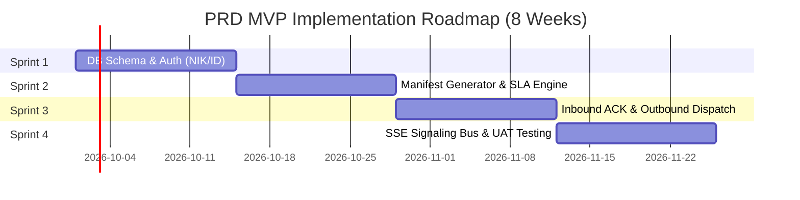

# Product Requirements Document (PRD) v5.1
## Courier Admin Mini-Panel: SLA & Priority Signaling System
> **System Focus:** Mid-Mile Early Warning & Capacity Control System  
> **Tech Stack:** React.js (Frontend) + Laravel REST API (Backend) + PostgreSQL + Redis + SSE  
> **Target Release:** MVP 2 Bulan (Sprints 1–4)  
> **Document Status:** `APPROVED FOR MVP`  

---

## 📋 Table of Contents
1. [Ringkasan Utama & Latar Belakang Produk](#1-ringkasan-utama--latar-belakang-produk)
2. [Tantangan Operasional yang Diantisipasi & Skenario Risiko](#2-tantangan-operasional-yang-diantisipasi--skenario-risiko)
3. [Profil Pengguna & Batasan Pengembangan (Scope Matrix)](#3-profil-pengguna--batasan-pengembangan-scope-matrix)
4. [Daftar 6 Fitur Utama Phase 1 MVP & Acceptance Criteria](#4-daftar-6-fitur-utama-phase-1-mvp--acceptance-criteria)
5. [Spesifikasi Antarmuka & Visual Signaling Standards](#5-spesifikasi-antarmuka--visual-signaling-standards)
6. [Arsitektur Tech Stack & Roadmap Peluncuran MVP (2 Bulan)](#6-arsitektur-tech-stack--roadmap-peluncuran-mvp-2-bulan)

---

## 1. Ringkasan Utama & Latar Belakang Produk

Dokumen **Product Requirements Document (PRD) v5.1** ini menetapkan spesifikasi produk mendasar bagi pengembangan sistem **Courier Admin Mini-Panel**. 

Visi utama dari produk ini adalah mentransformasi pengelolaan antrean paket di titik transit logistik (*hub*) dari pendekatan statis konvensional **First-In-First-Out (FIFO)** menjadi **Dynamic Priority Queue System** berbasis sisa waktu SLA dan kapasitas fisik hub.

Sistem ini dirancang dengan pendekatan **Multi-Tenant Multi-Hub Architecture**, di mana setiap Admin terisolasi pada `id_hub` tempatnya bertugas, didukung oleh pemicuan *real-time push signaling* via **Server-Sent Events (SSE)** untuk memantau beban kapasitas dan eskalasi keterlambatan paket.

---

## 2. Tantangan Operasional yang Diantisipasi & Skenario Risiko

| Skenario Risiko Operasional | Antisipasi & Solusi Sistem (PRD v5.1) |
| :--- | :--- |
| **Risiko Keterlambatan Paket Urgent (FIFO Bottleneck)** Saat volume tinggi, paket layanan ekspres (*Same Day*) berpotensi tertumpuk di barisan belakang antrean penyortiran fisik. | **Dynamic SLA Sorting Engine** Menghitung sisa menit batas waktu SLA (`remaining_minutes`) secara otomatis dan menempatkan paket paling mendekati *deadline* di urutan teratas antrean. |
| **Risiko Over-Capacity Tanpa Peringatan** Admin hub tidak memiliki visibilitas atas paket yang sedang dalam perjalanan (`In Transit`) menuju hub-nya sehingga hub berisiko melampaui daya tampung fisik. | **In-Transit Visibility & Threshold Control** Menampilkan kalkulasi total beban (`In Hub` + `In Transit`) dan memicu sinyal peringatan jika melampaui `max_capacity` hub. |
| **Risiko Keterlambatan Respon Intervensi** Admin terlambat mengeksekusi penanganan khusus pada paket bermasalah karena tidak adanya notifikasi otomatis. | **Event-Driven SSE Push Signaling** Bus sinyal memancarkan 3 event SSE utama (`INBOUND_ARRIVAL_SIGNAL`, `CAPACITY_LOAD_ALERT`, `SLA_BREACH_WARNING`) langsung ke antarmuka Admin. |

---

## 3. Profil Pengguna & Batasan Pengembangan (Scope Matrix)

### 3.1 Personas
* **Admin Hub / Head of Warehouse Operations:** Bekerja di area transit untuk memantau beban paket, melakukan konfirmasi penerimaan truk *inbound*, mengeksekusi *Priority Override*, dan mengelola *Outbound Dispatch*.
* **Operator Gudang:** Memproses pemindahan paket fisik ke Kurir Satria.

### 3.2 MVP Scope Matrix (Phase 1 vs Phase 2)

#### 🟢 Phase 1: In-Scope (MVP 2 Bulan Target - 6 Fitur Utama)
1. **`F-01`**: Autentikasi NIK / ID Operator & Penguncian Sesi Multi-Hub (Pre-setup accounts).
2. **`F-02`**: **Manifest Data Generator** (Draft `MNF-YYMM-XXXX`, Auto-Vehicle Determination, Transactional Bulk Insert).
3. **`F-03`**: **Dynamic SLA Queue Table & Dashboard Operations** (Dual-Metric Aggregator, Priority Sorting, 3-Color SLA Badge, Quick Release Handover Kurir Satria).
4. **`F-04`**: **Outbound Dispatch Action & Fleet Management** (Manifes `OUTBOUND_DISPATCH`, Kurir Standby, Aksi Berangkatkan pemicu rilis kapasitas Hub).
5. **`F-05`**: **Event-Driven Real-Time SSE Signaling Engine** (Spesifikasi 3 Event JSON Contract & UI Handling).
6. **`F-06`**: **Inbound Sorting & Fleet Acknowledgment (ACK)** (Rigid Capacity Check, Bulk Mutation ke `In Hub`, SLA Timestamp calculation).

#### 🔴 Phase 2: Post-MVP Expansion (Future Release)
1. Panel UI Kelola Super Admin (Create Hub, Assign Admin UI).
2. Penugasan kurir *last-mile* berbasis *GPS Live Tracking*.
3. Algoritma *Smart Routing* berbasis koordinat alamat pemesan.

---

## 4. Daftar 6 Fitur Utama Phase 1 MVP & Acceptance Criteria

### `F-01` Autentikasi NIK / ID Operator & Penguncian Sesi Multi-Hub
* [x] Login menggunakan NIK / ID Operator + Password (akun pre-setup oleh admin).
* [x] Sesi terikat secara eksplisit pada `assigned_hub_id`.

### `F-02` Manifest Data Generator
* [x] Men-generate kode draf `MNF-YYMM-XXXX` dan menentukan jenis armada secara otomatis (<30 paket = Blind Van, 31-50 paket = Truk Engkel, >50 paket = Truk Besar).
* [x] Bulk insert transaksional (`DB::transaction`) menyuntikkan paket status `in_transit`.

### `F-03` Dynamic SLA Queue Table & Dashboard Operations
* [x] Pengurutan antrean: `is_priority = TRUE` teratas, dilanjutkan sisa SLA dari terkecil ke terbesar.
* [x] Visual SLA Badge: Merah (<30m), Kuning (30-120m), Hijau (>120m).
* [x] Quick Release Handover ke Kurir Satria Standby membebaskan slot kapasitas Hub.

### `F-04` Outbound Dispatch Action & Fleet Management
* [x] Aksi "Berangkatkan" merilis beban kapasitas fisik Hub secara instan.
* [x] Aksi "Selesai" mengubah status seluruh paket di dalamnya menjadi `Delivered`.

### `F-05` Event-Driven Real-Time SSE Capacity Signaling
* [x] Sinyal `INBOUND_ARRIVAL_SIGNAL` memperbarui widget truk inbound & toast notification.
* [x] Sinyal `CAPACITY_LOAD_ALERT` menggerakkan gauge meter kapasitas secara live (naik/turun).
* [x] Sinyal `SLA_BREACH_WARNING` memperbarui badge angka merah di sidebar dan memicu tombol saran refresh antrean.

### `F-06` Inbound Sorting & Fleet Acknowledgment (ACK)
* [x] Rigid Capacity Check: menolak ACK jika `(In Hub + Manifest) > max_capacity`.
* [x] Bulk Mutation: mengubah paket `In Transit` menjadi `In Hub` dan mengkalkulasi `sla_deadline`.

---

## 5. Spesifikasi Antarmuka & Visual Signaling Standards

### 5.1 Visual Signaling Standard
* 🟢 **HIJAU (Safe Zone):** Sisa SLA > 120 menit & Kapasitas Hub < 80%. Status operasional normal.
* 🟡 **KUNING (Warning Zone):** Sisa SLA 30–120 menit OR Kapasitas Hub 80%–99%. Membutuhkan perhatian Admin.
* 🔴 **MERAH (Critical / Overdue):** Sisa SLA < 30 menit OR Kapasitas Hub ≥ 100%. Memicu alert SSE & butuh intervensi segera.

---

## 6. Arsitektur Tech Stack & Roadmap Peluncuran MVP (2 Bulan)

