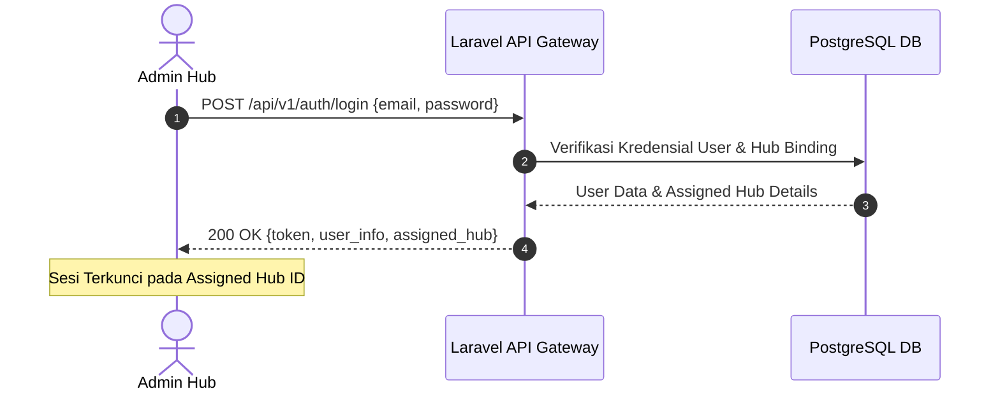

# 📄 Feature FRD: F-01 Autentikasi & Sesi Multi-Admin / Multi-Hub

---

### 1. Deskripsi Fitur
Fitur **Autentikasi & Sesi Multi-Admin / Multi-Hub** menyediakan mekanisme autentikasi login yang aman bagi petugas Admin Hub. Sesi login yang berhasil diterbitkan akan secara otomatis mengunci konteks kerja Admin pada lokasi Hub tempatnya bertugas, sehingga seluruh data operasional, metrik statistik, dan notifikasi terisolasi secara ketat khusus untuk Hub tersebut. Fitur ini juga mendukung skenario di mana satu lokasi Hub dikelola oleh lebih dari satu Admin secara bersamaan.

---

### 2. Aturan Bisnis Terkait (Business Rules)
* **`BR-01`**: Seluruh data operasional paket dan statistik yang ditampilkan pada dashboard terisolasi secara ketat berdasarkan `hub_id` yang terikat pada akun Admin yang sedang login.
* **`BR-08`**: Satu lokasi Hub dapat diakses dan dikelola oleh beberapa Admin secara sejajar. Aktivitas perubahannya diperbarui secara konsisten di seluruh sesi Admin yang terhubung pada Hub tersebut.

---

### 3. Alur Kerja & Spesifikasi API

#### **3.1. Flow Diagram**


#### **3.2. API Contract Specification**
* **Endpoint**: `POST /api/v1/auth/login`
* **Request Payload**:
  ```json
  {
    "email": "admin.budi@courier.com",
    "password": "secretpassword"
  }
  ```
* **Response Payload (200 OK)**:
  ```json
  {
    "status": "success",
    "data": {
      "token": "1|bearer_token_string",
      "user": {
        "id": 102,
        "name": "Admin Budi",
        "email": "admin.budi@courier.com",
        "role": "admin_hub",
        "assigned_hub": {
          "id": "HUB-JKS-01",
          "name": "Jakarta Selatan Transit Hub",
          "max_capacity": 200
        }
      }
    }
  }
  ```

---

### 4. Acceptance Criteria
* [x] Admin hanya dapat melakukan login menggunakan kredensial email dan password yang terdaftar secara sah.
* [x] Sesi login yang diterbitkan mengunci seluruh akses kueri data hanya untuk lokasi Hub tempat Admin bertugas.
* [x] Lebih dari satu Admin dapat login pada Hub yang sama secara bersamaan tanpa saling mengganggu konteks sesi.
