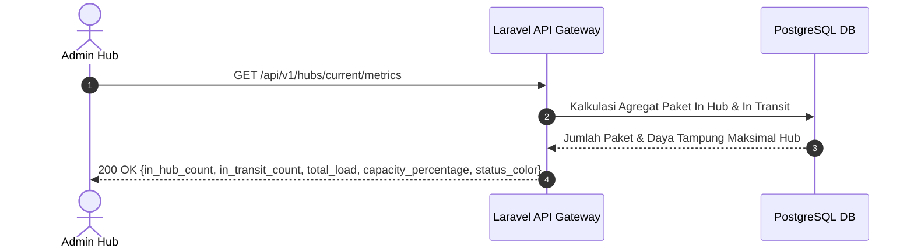

# 📄 Feature FRD: F-02 Dashboard Admin Hub & Monitoring Dual-Metrik

---

### 1. Deskripsi Fitur
Fitur **Dashboard Admin Hub & Monitoring Dual-Metrik** menyediakan antarmuka pemantauan utama (*Main Dashboard*) yang menyajikan statistik real-time jumlah paket yang berada di lokasi gudang (*In Hub*) dan paket yang sedang dalam perjalanan menuju hub tersebut (*In Transit*), serta indikator visual tingkat keterisian kapasitas hub (*Capacity Load Gauge*) terhadap batas daya tampung fisik maksimalnya.

---

### 2. Aturan Bisnis Terkait (Business Rules)
* **`BR-02`**: Total beban kerja hub dikalkulasikan dari akumulasi penjumlahan jumlah paket yang berada di gudang (berstatus *In Hub*) ditambah paket yang sedang dalam perjalanan menuju hub tersebut (berstatus *In Transit*).
* **`BR-03`**: Indikator warna kapasitas dikategorikan secara visual menjadi:
  * **Zona Hijau (Safe Zone):** Rasio beban kerja kurang dari 80% dari kapasitas maksimal.
  * **Zona Kuning (Warning Zone):** Rasio beban kerja berada di rentang 80% hingga 99% dari kapasitas maksimal.
  * **Zona Merah (Over-Capacity Zone):** Rasio beban kerja mencapai atau melebihi 100% dari kapasitas maksimal.

---

### 3. Alur Kerja & Spesifikasi API

#### **3.1. Flow Diagram**


#### **3.2. API Contract Specification**
* **Endpoint**: `GET /api/v1/hubs/current/metrics`
* **Response Payload (200 OK)**:
  ```json
  {
    "status": "success",
    "data": {
      "hub_id": "HUB-JKS-01",
      "hub_name": "Jakarta Selatan Transit Hub",
      "max_capacity": 200,
      "metrics": {
        "in_hub_count": 142,
        "in_transit_count": 38,
        "total_load": 180,
        "capacity_percentage": 90.0,
        "status_zone": "WARNING",
        "status_color": "#F59E0B"
      }
    }
  }
  ```

---

### 4. Acceptance Criteria
* [x] Kartu metrik menampilkan jumlah paket yang berada di gudang (*In Hub*) dan dalam perjalanan (*In Transit*) secara akurat.
* [x] Gauge kapasitas menampilkan persentase rasio total beban terhadap daya tampung maksimal hub.
* [x] Indikator visual berubah warna secara otomatis menjadi Kuning saat beban mencapai ≥80% dan Merah saat beban mencapai ≥100%.
