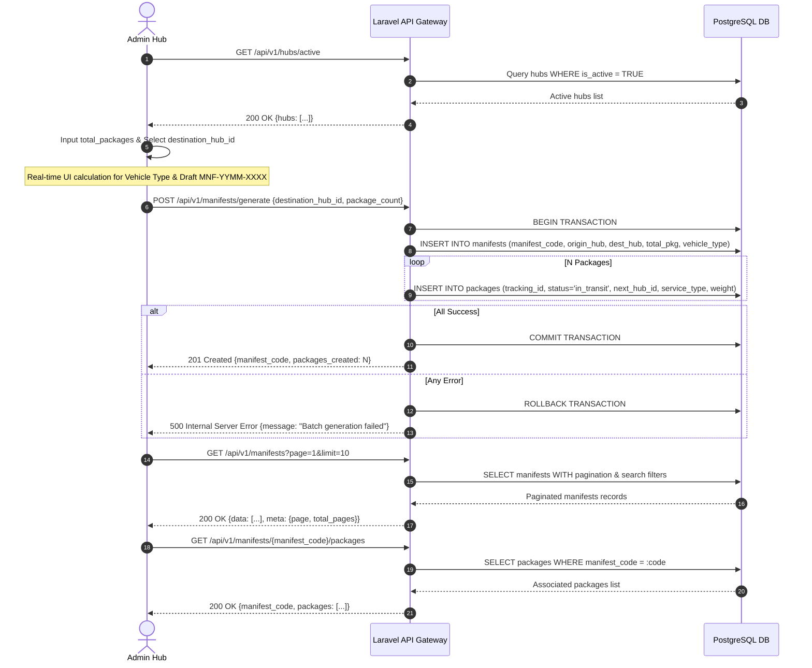

# 📄 Feature FRD: F-02 Manifest Data Generator

---

### 1. Deskripsi Fitur
Fitur **Manifest Data Generator** berfungsi sebagai mesin simulasi dan pemuatan data manifes pengiriman secara masif (*bulk ingestion engine*). Fitur ini memungkinkan pengguna untuk membuat skenario penanganan paket antar-hub, menghitung estimasi kebutuhan jenis armada secara otomatis, melakukan *bulk insert* transaksional ke database, serta memantau log riwayat manifes beserta detail resi di dalamnya. 

Seluruh paket yang dihasilkan dari manifes ini secara otomatis disuntikkan status `in_transit` dengan tujuan hub destinasi agar langsung terbaca oleh mesin pemantau SLA dan simulasi indikator kapasitas hub.

---

### 2. Aturan Bisnis Terkait (Business Rules)

* **`BR-02.1` Master Hub Data Retrieval (Dropdown Destinasi)**:
  * Dropdown pilihan destinasi hanya menampilkan daftar hub logistik yang berstatus operasional aktif (`is_active = TRUE`).
* **`BR-02.2` Dynamic Payload Preview & Auto-Vehicle Determination**:
  * Sistem membuat kode draf manifes unik dengan format `MNF-YYMM-XXXX` (misal: `MNF-2609-0012`) yang berfungsi sebagai *primary identifier* pada *payload* API.
  * Jenis armada ditentukan secara otomatis (*Auto-Vehicle Determination*) berdasarkan kalkulasi total kuantitas paket:
    * **< 30 Paket**: Blind Van / Mobil Operasional
    * **31 – 50 Paket**: Truk Engkel (Medium Truck)
    * **> 50 Paket**: Truk Besar / Tronton (Heavy Truck)
* **`BR-02.3` Bulk Simulator Engine (Transactional Ingestion)**:
  * Eksekusi tombol "Buat & Kirim Skenario Manifest" diproses secara *atomic database transaction* (`DB::transaction`).
  * Sistem membuat 1 record di tabel `manifests` dan secara bersamaan melakukan perulangan untuk men-generate $N$ baris record paket di tabel `packages`.
  * Setiap paket di-generate dengan Tracking ID dummy unik, berat paket acak (1–10 kg), dan tipe layanan acak (`Same Day`, `Next Day`, `Regular`).
  * Seluruh paket otomatis disuntikkan status `in_transit` dengan `next_hub_id` mengarah ke hub destinasi.
  * Jika terjadi 1 kegagalan dalam proses batch insert, seluruh transaksi harus di-rollback (*all-or-nothing*).
* **`BR-02.4` Manifest Log Table & Pagination**:
  * Riwayat manifes ditampilkan menggunakan mekanisme *pagination* efisien dengan batasan maksimal 10 baris per halaman (*limit 10, offset*).
  * Filter pencarian (*Search*) mendukung kueri pencocokan string (*case-insensitive*) pada kolom `manifest_code` atau `hub_name` destinasi.
  * Terdapat dropdown filter untuk menyortir riwayat berdasarkan Hub Target tertentu.
* **`BR-02.5` Manifest Detail Action**:
  * Setiap baris riwayat manifes menyediakan tombol aksi "Detail".
  * Menekan tombol "Detail" akan memicu panggilan API untuk mengambil seluruh rincian paket/resi yang terasosiasi dengan `manifest_code` tersebut dan menampilkannya di dalam modal/popup interaktif (Relasi 1 Manifest : N Packages).

---

### 3. Alur Kerja & Spesifikasi API

#### **3.1. Flow Diagram**


#### **3.2. API Contract Specification**

* **1. Master Active Hubs Endpoint**:
  * **Endpoint**: `GET /api/v1/hubs/active`
  * **Response Payload (200 OK)**:
    ```json
    {
      "status": "success",
      "data": [
        {
          "id": 1,
          "hub_code": "HUB-JKS-01",
          "hub_name": "Hub Jakarta Selatan"
        },
        {
          "id": 2,
          "hub_code": "HUB-JKT-02",
          "hub_name": "Hub Jakarta Barat"
        }
      ]
    }
    ```

* **2. Bulk Manifest Generator Endpoint**:
  * **Endpoint**: `POST /api/v1/manifests/generate`
  * **Request Payload**:
    ```json
    {
      "destination_hub_id": 2,
      "total_packages": 45
    }
    ```
  * **Response Payload (201 Created)**:
    ```json
    {
      "status": "success",
      "message": "Manifest successfully generated with 45 packages in transit",
      "data": {
        "manifest_code": "MNF-2609-0012",
        "origin_hub_id": "HUB-JKS-01",
        "destination_hub_id": "HUB-JKT-02",
        "total_packages": 45,
        "vehicle_type": "Truk Engkel",
        "status": "in_transit",
        "created_at": "2026-09-22T05:00:00Z"
      }
    }
    ```

* **3. Manifest Log & Pagination Endpoint**:
  * **Endpoint**: `GET /api/v1/manifests?page=1&limit=10&search=MNF-2609&destination_hub_id=2`
  * **Response Payload (200 OK)**:
    ```json
    {
      "status": "success",
      "data": [
        {
          "manifest_code": "MNF-2609-0012",
          "destination_hub_name": "Hub Jakarta Barat",
          "total_packages": 45,
          "vehicle_type": "Truk Engkel",
          "created_at": "2026-09-22 05:00:00"
        }
      ],
      "meta": {
        "current_page": 1,
        "per_page": 10,
        "total_records": 1,
        "total_pages": 1
      }
    }
    ```

* **4. Manifest Packages Detail Endpoint**:
  * **Endpoint**: `GET /api/v1/manifests/{manifest_code}/packages`
  * **Response Payload (200 OK)**:
    ```json
    {
      "status": "success",
      "data": {
        "manifest_code": "MNF-2609-0012",
        "destination_hub": "Hub Jakarta Barat",
        "total_packages": 45,
        "packages": [
          {
            "tracking_id": "TRK-20260922-001",
            "service_type": "Same Day",
            "weight_kg": 2.5,
            "status": "in_transit",
            "sla_deadline": "2026-09-22T12:00:00Z"
          }
        ]
      }
    }
    ```

---

### 4. Acceptance Criteria
* [x] Dropdown destinasi hanya menampilkan hub dengan `is_active = TRUE`.
* [x] Preview skenario menghitung kode `MNF-YYMM-XXXX` dan menentukan jenis armada secara otomatis (<30 paket = Blind Van, 31-50 paket = Truk Engkel, >50 paket = Truk Besar).
* [x] Tombol eksekusi melakukan *bulk insert* transaksional ke tabel `manifests` dan `packages` dengan status paket otomatis `in_transit`. Jika ada kegagalan, seluruh batch di-rollback.
* [x] Tabel riwayat manifes mendukung *pagination* (10 baris/halaman), pencarian string `manifest_code`/`hub_name`, dan filter target hub.
* [x] Menekan tombol "Detail" membuka modal yang menampilkan seluruh paket dalam manifes terkait.
