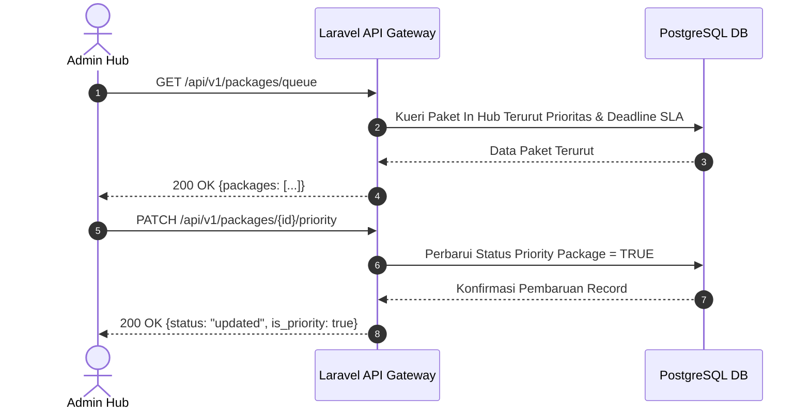

# 📄 Feature FRD: F-03 Dynamic SLA Queue Table & Priority Override

---

### 1. Deskripsi Fitur
Fitur **Dynamic SLA Queue Table & Priority Override** menyajikan tabel antrean interaktif berisi seluruh paket berstatus berada di lokasi gudang (*In Hub*). Antrean ini diurutkan secara dinamis dengan menempatkan paket yang memiliki penanda prioritas manual (*Priority Override*) di urutan teratas, dilanjutkan oleh paket yang memiliki sisa waktu SLA paling sedikit. Admin dapat mengubah prioritas paket secara manual menggunakan tombol aksi toggle pada tabel antrean.

---

### 2. Aturan Bisnis Terkait (Business Rules)
* **`BR-04`**: Antrean diurutkan secara dinamis berdasarkan prioritas utama pada paket yang memiliki pengaktifan prioritas manual (`is_priority = true`), kemudian dilanjutkan berdasarkan urutan sisa waktu SLA dari yang paling mendekati batas deadline pengiriman.
* **`BR-05`**: Pengaktifan tombol *Priority Override* mengubah status prioritas paket menjadi aktif dan secara otomatis memindahkan posisi paket tersebut ke baris teratas pada tabel antrean.
* **`BR-10`**: Sisa waktu SLA dihitung dari selisih antara waktu deadline pengiriman dengan waktu saat ini, di mana paket dengan sisa waktu kurang dari 30 menit ditandai dengan warna indikator kondisi kritis.

---

### 3. Alur Kerja & Spesifikasi API

#### **3.1. Flow Diagram**


#### **3.2. API Contract Specification**
* **Endpoint 1 (Get Queue)**: `GET /api/v1/packages/queue`
* **Response Payload (200 OK)**:
  ```json
  {
    "status": "success",
    "data": [
      {
        "id": "PKG-1001",
        "tracking_number": "TRK-2139410001",
        "service_type": "Same Day",
        "status": "in_hub",
        "hub_arrival_timestamp": "2026-09-18 08:00:00",
        "sla_deadline": "2026-09-18 10:00:00",
        "remaining_minutes": 18,
        "is_priority": true,
        "severity_color": "#EF4444"
      }
    ]
  }
  ```
* **Endpoint 2 (Toggle Priority)**: `PATCH /api/v1/packages/{id}/priority`

---

### 4. Acceptance Criteria
* [x] Paket yang memiliki status prioritas manual (`is_priority = true`) selalu ditempatkan di posisi teratas antrean.
* [x] Paket tanpa prioritas manual diurutkan secara otomatis berdasarkan sisa waktu SLA terpendek yang paling mendekati deadline.
* [x] Mengklik tombol *Priority Override* dengan cepat memperbarui status prioritas paket dan menyesuaikan ulang urutan antrean di layar.
