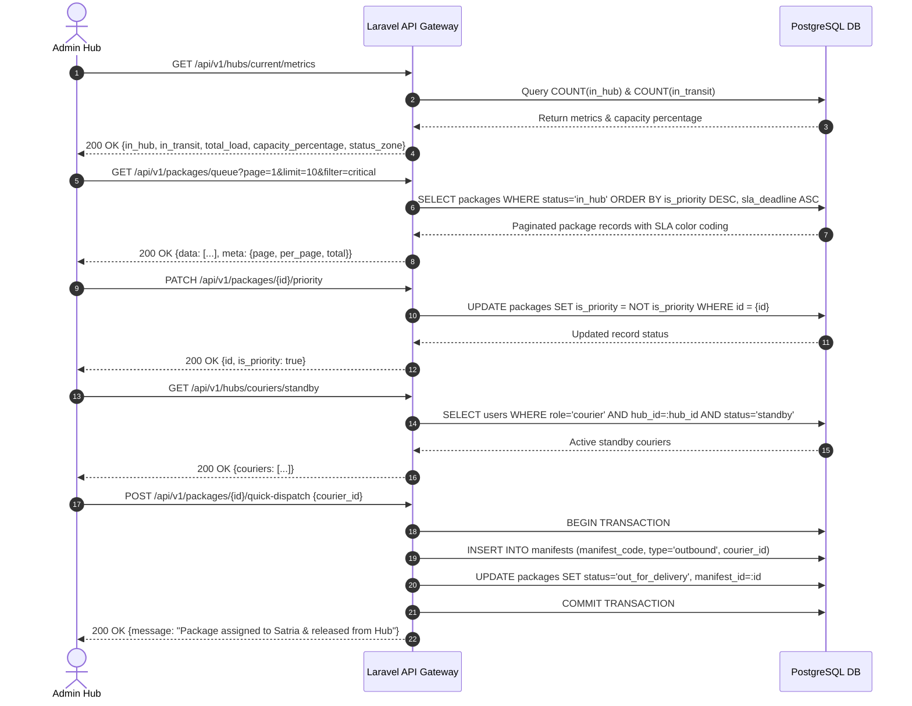

# 📄 Feature FRD: F-03 Dynamic SLA Queue & Dashboard Operations

---

### 1. Deskripsi Fitur
Fitur **Dynamic SLA Queue & Dashboard Operations** menyediakan antarmuka pusat bagi Admin Hub untuk memantau kapasitas beban hub secara real-time, mengelola antrean penyortiran paket berdasarkan batas waktu SLA, melakukan intervensi tingkat urgensi (*Priority Escalation*), serta mengeksekusi rilis cepat (*Quick Release Outbound Dispatch*) langsung ke Kurir Satria standby demi mencegah pelanggaran batas waktu SLA (*SLA Breach*).

---

### 2. Sub-Fitur & Aturan Bisnis Terkait (Business Rules)

#### **F03.1 - Real-time Capacity & Load Aggregator (Widget Atas)**
* **Fungsi**: Mengambil dan mengalkulasi total beban paket (`In Hub` & `In Transit`) dalam satu request API atau *payload SSE*.
* **Business Rules (BR)**:
  * **BR-03.1.1**: Sistem menghitung total paket `In Hub` (posisi fisik paket saat ini berada di hub admin).
  * **BR-03.1.2**: Sistem menghitung total paket `In Transit` (paket yang sedang dalam perjalanan menuju hub admin).
  * **BR-03.1.3**: Mengalkulasi total beban (`Total Load = In Hub + In Transit`) dan membandingkannya dengan `max_capacity` Hub (misal: 200 paket).
  * **BR-03.1.4**: Jika total beban mencapai atau melebihi *threshold* persentase tertentu (misal: ≥90%), antarmuka pengguna (UI) akan memicu peringatan *Capacity Warning Alert* secara visual.

#### **F03.2 - Dynamic SLA Queue Table & Pagination**
* **Fungsi**: Menampilkan daftar antrean paket berstatus `In Hub` dengan paginasi efisien (10 data per halaman) dan pengurutan dinamis.
* **Business Rules (BR)**:
  * **BR-03.2.1 (Sorting Logic)**: Tabel wajib diurutkan berdasarkan `is_priority` terlebih dahulu (paket berstatus Prioritas selalu berada di posisi paling atas), kemudian diikuti oleh sisa menit SLA (`remaining_minutes`) dari yang terkecil hingga terbesar.
  * **BR-03.2.2 (Visual State Mutation - 3 Warna)**: UI membaca nilai sisa waktu SLA dan merender indikator warna tingkat urgensi:
    * 🔴 **Merah (Critical)**: Sisa SLA < 30 menit (Urgensi Tinggi / Mendekati Breach).
    * 🟡 **Kuning (Warning)**: Sisa SLA 30 – 120 menit (Peringatan).
    * 🟢 **Hijau (Normal)**: Sisa SLA > 120 menit (Aman).

#### **F03.3 - Priority Escalation & Critical Filter**
* **Fungsi**: Menyediakan tombol intervensi manual untuk mengatur kedaruratan paket serta memfilter antrean kritis.
* **Business Rules (BR)**:
  * **BR-03.3.1 (Set Priority / Remove Flag)**: Tombol aksi pada setiap baris tabel untuk mengubah status kolom `is_priority` di database. Begitu diklik, paket secara otomatis melompat ke posisi antrean paling atas.
  * **BR-03.3.2 (Filter Critical Packages)**: Tombol filter pada kotak peringatan atas yang jika diaktifkan akan menyaring tabel antrean agar hanya menampilkan paket berstatus Prioritas (`is_priority = TRUE`) dan paket Merah (`Critical < 30m`).

#### **F03.4 - Quick Release Outbound Dispatch (Modal Handover)**
* **Fungsi**: Eksekusi langsung pemindahan 1 paket spesifik ke Kurir Satria yang bersiap di lokasi untuk mencegah *SLA Breach*.
* **Business Rules (BR)**:
  * **BR-03.4.1 (Courier Retrieval)**: Saat tombol "Outbound Dispatch" pada baris paket ditekan, sistem mengambil daftar pengguna (Kurir Satria) yang berstatus *Standby* atau *Ready Now* di hub tersebut.
  * **BR-03.4.2 (Direct Last-Mile Execution)**: Saat tombol "Konfirmasi & Berangkatkan Satria" ditekan, sistem men-generate 1 record manifes baru berjenis *Outbound*, mengikatnya pada kurir yang dipilih, dan mengubah status paket menjadi `out_for_delivery` atau `in_transit`.
  * **BR-03.4.3 (Capacity Release)**: Paket yang dieksekusi langsung hilang dari tabel antrean Dashboard SLA Queue ini dan membebaskan 1 slot kapasitas fisik Hub secara instan.

---

### 3. Alur Kerja & Spesifikasi API

#### **3.1. Flow Diagram**


#### **3.2. API Contract Specification**

* **1. Hub Metrics & Load Aggregator Endpoint**:
  * **Endpoint**: `GET /api/v1/hubs/current/metrics`
  * **Response Payload (200 OK)**:
    ```json
    {
      "status": "success",
      "data": {
        "hub_id": "HUB-JKS-01",
        "hub_name": "Hub Jakarta Selatan",
        "max_capacity": 200,
        "metrics": {
          "in_hub_count": 142,
          "in_transit_count": 38,
          "total_load": 180,
          "capacity_percentage": 90.0,
          "status_zone": "WARNING",
          "alert_triggered": true
        }
      }
    }
    ```

* **2. Dynamic SLA Queue & Filter Endpoint**:
  * **Endpoint**: `GET /api/v1/packages/queue?page=1&limit=10&filter=critical`
  * **Response Payload (200 OK)**:
    ```json
    {
      "status": "success",
      "data": [
        {
          "package_id": "PKG-1001",
          "tracking_id": "TRK-2139410001",
          "service_type": "Same Day",
          "status": "in_hub",
          "hub_arrival_timestamp": "2026-09-22 08:00:00",
          "sla_deadline": "2026-09-22 10:00:00",
          "remaining_minutes": 18,
          "is_priority": true,
          "severity_zone": "CRITICAL",
          "severity_color": "#EF4444"
        }
      ],
      "meta": {
        "current_page": 1,
        "per_page": 10,
        "total_records": 15,
        "total_pages": 2
      }
    }
    ```

* **3. Priority Escalation Toggle Endpoint**:
  * **Endpoint**: `PATCH /api/v1/packages/{id}/priority`
  * **Response Payload (200 OK)**:
    ```json
    {
      "status": "success",
      "message": "Package priority escalated successfully",
      "data": {
        "package_id": "PKG-1001",
        "is_priority": true
      }
    }
    ```

* **4. Standby Couriers Retrieval Endpoint**:
  * **Endpoint**: `GET /api/v1/hubs/couriers/standby`
  * **Response Payload (200 OK)**:
    ```json
    {
      "status": "success",
      "data": [
        {
          "courier_id": "COU-101",
          "courier_name": "Satria Budi",
          "vehicle_type": "Motorcycle",
          "status": "standby"
        }
      ]
    }
    ```

* **5. Quick Release Outbound Dispatch Endpoint**:
  * **Endpoint**: `POST /api/v1/packages/{id}/quick-dispatch`
  * **Request Payload**:
    ```json
    {
      "courier_id": "COU-101",
      "notes": "Handover urgent Same Day package to prevent SLA breach"
    }
    ```
  * **Response Payload (200 OK)**:
    ```json
    {
      "status": "success",
      "message": "Package successfully assigned to Satria Budi and status updated to Out for Delivery",
      "data": {
        "package_id": "PKG-1001",
        "manifest_code": "MNF-OUT-2609-0089",
        "courier_name": "Satria Budi",
        "new_status": "out_for_delivery",
        "capacity_freed": 1
      }
    }
    ```

---

### 4. Acceptance Criteria
* [x] Widget atas menampilkan statistik akurat `In Hub`, `In Transit`, `Total Load`, dan memicu *Capacity Warning Alert* jika beban mencapai ≥90%.
* [x] Antrean diurutkan secara dinamis: paket `is_priority = TRUE` paling atas, disusul oleh sisa SLA terpendek (`remaining_minutes`).
* [x] UI merender indikator warna otomatis: Merah (<30m), Kuning (30–120m), dan Hijau (>120m).
* [x] Tombol *Set Priority* secara instan mengubah `is_priority = TRUE` dan menempatkan paket di puncak antrean.
* [x] Tombol *Filter Critical Packages* menyaring antrean untuk hanya memuat paket Prioritas dan paket berkategori Merah (<30m).
* [x] Modal *Outbound Dispatch* mengambil daftar Kurir Satria *standby* dan mengeksekusi rilis paket langsung (`out_for_delivery`), serta membebaskan 1 slot kapasitas Hub secara instan.
