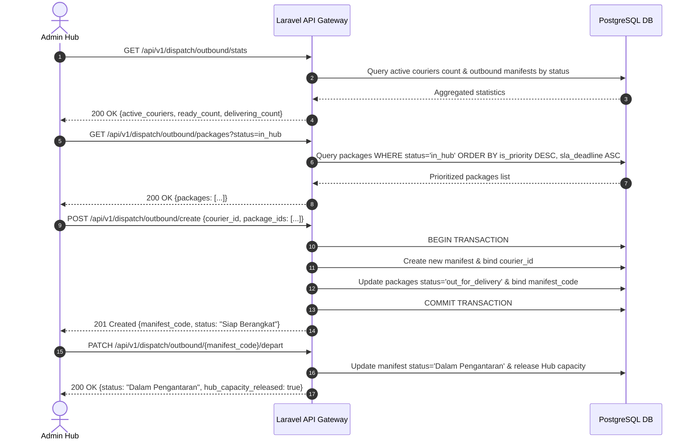

# 📄 Feature FRD: F-04 Outbound Dispatch Action & Fleet Management

---

### 1. Deskripsi Fitur
Fitur **Outbound Dispatch Action & Fleet Management** memfasilitasi proses konsolidasi paket keluar dari Hub ke armada kurir *last-mile* (Kurir Satria) maupun transfer antar-hub. Fitur ini mencakup agregasi statistik armada kurir aktif, papan pengawasan batch manifes pengeluaran (*Active Dispatch Batches Board*), modal pembuatan manifes serah-terima dengan kurir standby, serta eksekusi pelepasan beban kapasitas Hub secara fisik (*capacity release*).

---

### 2. Aturan Bisnis Terkait (Business Rules)

* **`BR-04.1` Outbound Fleet & Dispatch Statistics (Widget Atas)**:
  * **Armada Kurir Aktif**: Menghitung total personel kurir (*users* dengan role Kurir) yang terikat pada Hub ini dan berstatus *Standby / Ready*.
  * **Siap Berangkat**: Menghitung jumlah manifes tipe *Outbound Dispatch* dari Hub ini yang berstatus *Siap Berangkat* (manifes sudah dibentuk, namun kurir belum memuai pengantaran).
  * **Dalam Pengantaran**: Menghitung jumlah manifes *Outbound Dispatch* yang berstatus *Dalam Pengantaran* (kurir sedang dalam perjalanan menuju penerima/hub tujuan).

* **`BR-04.2` Active Dispatch Batches Board (Grid Manajemen Manifes)**:
  * Menampilkan kartu manifes pengeluaran aktif (`type = OUTBOUND_DISPATCH`) dengan paginasi berbasis kartu (misal: 4 *cards* per halaman).
  * **Aksi "Berangkatkan"**:
    * Mengubah status manifes dari *Siap Berangkat* menjadi *Dalam Pengantaran*.
    * **Trigger Pelepasan Kapasitas**: Pada saat tombol ini ditekan, sistem secara otomatis merilis beban paket dari kuota kapasitas Hub (`max_capacity`) karena paket secara fisik telah keluar dari gerbang Hub.
  * **Aksi "Selesai"**:
    * Tombol ini muncul untuk manifes yang berstatus *Dalam Pengantaran*.
    * Menekan tombol ini mengubah status manifes menjadi *Selesai* dan secara otomatis mentransisikan seluruh status paket di dalamnya menjadi *Delivered* (Terkirim).

* **`BR-04.3` Create Dispatch Batch & Courier Assignment (Modal Serah Terima)**:
  * **Fetch Standby Couriers**: Mengambil dan menampilkan daftar kurir yang sedang tidak membawa beban tugas (*Standby*).
  * **Fetch Packages (Cursor Pagination & Priority Sorting)**: Mengambil data paket berstatus `In Hub`. Kueri antrean diurutkan secara dinamis mendahulukan paket prioritas (`is_priority = TRUE`) dan paket paling mendekati batas SLA (*Merah / Critical*) agar berada di urutan teratas daftar pilihan.
  * **Dynamic Summary**: UI menghitung total kuantitas paket yang diceklis secara *real-time* sebelum konfirmasi.
  * **Execution (Tombol Konfirmasi)**:
    * Sistem men-generate ID / Kode Manifes *Outbound* baru.
    * Menyuntikkan kode manifes tersebut ke paket-paket yang dipilih.
    * Mengubah status paket-paket terpilih menjadi *Out for Delivery* / *Siap Berangkat*.
    * Mengikat manifes tersebut dengan ID Kurir (*courier_id*) yang ditugaskan.

---

### 3. Alur Kerja & Spesifikasi API

#### **3.1. Flow Diagram**


#### **3.2. API Contract Specification**

* **1. Outbound Statistics Endpoint**:
  * **Endpoint**: `GET /api/v1/dispatch/outbound/stats`
  * **Response Payload (200 OK)**:
    ```json
    {
      "status": "success",
      "data": {
        "active_couriers_standby": 8,
        "manifests_ready_to_depart": 3,
        "manifests_in_transit": 5
      }
    }
    ```

* **2. Standby Couriers Endpoint**:
  * **Endpoint**: `GET /api/v1/couriers/standby`
  * **Response Payload (200 OK)**:
    ```json
    {
      "status": "success",
      "data": [
        {
          "courier_id": "COU-8801",
          "name": "Satria Budi",
          "phone": "08123456789",
          "status": "Standby"
        }
      ]
    }
    ```

* **3. Create Dispatch Batch Endpoint**:
  * **Endpoint**: `POST /api/v1/dispatch/outbound/create`
  * **Request Payload**:
    ```json
    {
      "courier_id": "COU-8801",
      "package_ids": ["PKG-1001", "PKG-1002", "PKG-1005"]
    }
    ```
  * **Response Payload (201 Created)**:
    ```json
    {
      "status": "success",
      "message": "Outbound dispatch manifest successfully created",
      "data": {
        "manifest_code": "MNF-OUT-20260922-001",
        "courier_name": "Satria Budi",
        "total_packages": 3,
        "status": "Siap Berangkat"
      }
    }
    ```

* **4. Depart Dispatch Batch Endpoint (Capacity Release Trigger)**:
  * **Endpoint**: `PATCH /api/v1/dispatch/outbound/{manifest_code}/depart`
  * **Response Payload (200 OK)**:
    ```json
    {
      "status": "success",
      "message": "Manifest departed. Hub load capacity successfully updated.",
      "data": {
        "manifest_code": "MNF-OUT-20260922-001",
        "status": "Dalam Pengantaran",
        "capacity_released_count": 3
      }
    }
    ```

* **5. Complete Dispatch Batch Endpoint**:
  * **Endpoint**: `PATCH /api/v1/dispatch/outbound/{manifest_code}/complete`
  * **Response Payload (200 OK)**:
    ```json
    {
      "status": "success",
      "message": "Manifest completed. All associated packages updated to Delivered.",
      "data": {
        "manifest_code": "MNF-OUT-20260922-001",
        "status": "Selesai",
        "packages_delivered_count": 3
      }
    }
    ```

---

### 4. Acceptance Criteria
* [x] Widget statistik menampilkan jumlah kurir standby, manifes siap berangkat, dan manifes dalam pengantaran secara akurat.
* [x] Papan manifes aktif menampilkan kartu periferal bertipe *Outbound Dispatch* dengan fitur paginasi.
* [x] Tombol "Berangkatkan" mengubah status manifes menjadi *Dalam Pengantaran* dan melepaskan jumlah kuota kapasitas Hub secara fisik.
* [x] Tombol "Selesai" merubah status manifes menjadi *Selesai* dan menandai seluruh paket di dalamnya sebagai *Delivered*.
* [x] Modal pembuatan manifes menyajikan daftar kurir standby serta paket berstatus `In Hub` yang diurutkan mengutamakan paket prioritas dan kritis SLA.
