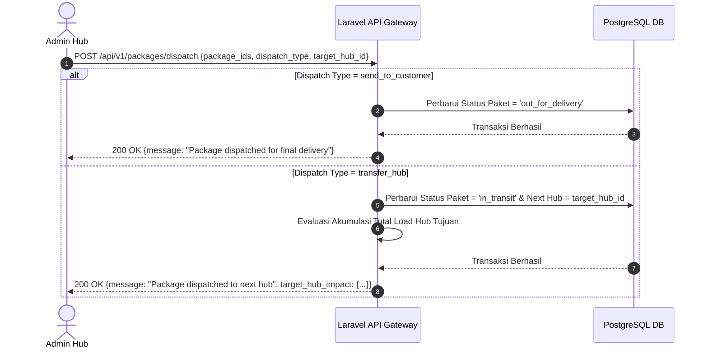

# 📄 Feature FRD: F-04 Outbound Dispatch Action

---

### 1. Deskripsi Fitur
Fitur **Outbound Dispatch Action** menyediakan sarana bagi Admin Hub untuk merilis paket yang telah selesai diproses dari area gudang. Fitur ini menyediakan dua pilihan rilis paket:
1. **Transfer to Next Hub:** Mengirimkan paket ke titik transit hub berikutnya (status paket berubah menjadi *In Transit* menuju Hub tujuan).
2. **Send to Customer:** Menyerahkan paket ke kurir pengantar akhir (*last-mile delivery*) untuk dikirim langsung ke pelanggan (status paket berubah menjadi *Out for Delivery* dan keluar dari antrean penanganan hub).

---

### 2. Aturan Bisnis Terkait (Business Rules)
* **`BR-06`**: Pemilihan aksi *Transfer to Next Hub* mengubah status lokasi paket menjadi *In Transit* dan menetapkan lokasi hub tujuan berikutnya. Sedangkan pilihan *Send to Customer* mengubah status paket menjadi *Out for Delivery*, yang secara resmi melepaskan paket dari antrean hub.
* **`BR-07`**: Apabila transaksi rilis paket menggunakan opsi transfer ke hub lain terdeteksi menyebabkan akumulasi beban di hub tujuan melebihi batas kapasitas maksimalnya, sistem secara instan memicu sinyal peringatan kapasitas (*Event-Driven SSE Capacity Alert*).

---

### 3. Alur Kerja & Spesifikasi API

#### **3.1. Flow Diagram**


#### **3.2. API Contract Specification**
* **Endpoint**: `POST /api/v1/packages/dispatch`
* **Request Payload**:
  ```json
  {
    "package_ids": ["PKG-1001", "PKG-1002"],
    "dispatch_type": "transfer_hub",
    "target_hub_id": "HUB-JKT-02"
  }
  ```
* **Response Payload (200 OK)**:
  ```json
  {
    "status": "success",
    "message": "Outbound dispatch successfully processed.",
    "data": {
      "dispatched_count": 2,
      "dispatch_type": "transfer_hub",
      "target_hub_id": "HUB-JKT-02",
      "signaling_triggered": true
    }
  }
  ```

---

### 4. Acceptance Criteria
* [x] Admin dapat memilih satu atau beberapa paket untuk dirilis secara bersamaan.
* [x] Memilih opsi *Send to Customer* mengubah status paket menjadi *Out for Delivery* dan mengeluarkannya dari antrean gudang.
* [x] Memilih opsi *Transfer to Next Hub* mengubah status paket menjadi *In Transit* dan memperbarui lokasi hub tujuan berikutnya.
