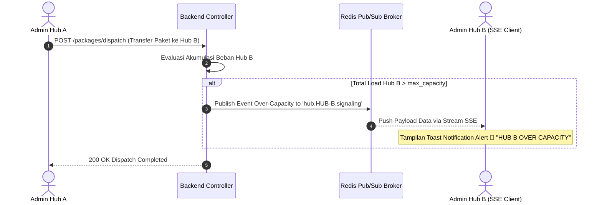

# 📄 Feature FRD: F-05 Event-Driven Real-Time SSE Capacity Signaling

---

### 1. Deskripsi Fitur
Fitur **Event-Driven Real-Time SSE Capacity Signaling** menyediakan mekanisme penyampaian notifikasi peringatan secara instan dan otomatis tanpa perlu melakukan refresh halaman (*Server-Sent Events*). Ketika transaksi rilis paket (*Outbound Dispatch*) antar-hub dieksekusi dari Hub A ke Hub B dan menyebabkan akumulasi beban kerja Hub B melebihi batas kapasitas maksimalnya (`max_capacity`), sistem secara instan memancarkan sinyal notifikasi peringatan (*Capacity Alert*) langsung ke layar peramban Admin yang sedang bertugas di Hub B.

---

### 2. Aturan Bisnis Terkait (Business Rules)
* **`BR-07`**: Notifikasi peringatan dipicu secara instan pada layer backend segera setelah transaksi pengiriman paket antar-hub terdeteksi menyebabkan total beban di hub tujuan melebihi batas kapasitas maksimalnya.
* **`BR-08`**: Notifikasi dipancarkan secara terisolasi ke channel pesan hub tujuan, sehingga seluruh Admin yang sedang terhubung pada hub tersebut menerima pesan peringatan secara bersamaan di layar peramban masing-masing.

---

### 3. Alur Kerja & Spesifikasi API

#### **3.1. Flow Diagram**


#### **3.2. SSE Stream Contract Specification**
* **Endpoint Subscription**: `GET /api/v1/sse/subscribe` (Header: `Accept: text/event-stream`)
* **Event Stream Payload JSON Format**:
  ```text
  event: capacity_alert
  data: {
    "alert_type": "OVER_CAPACITY",
    "target_hub_id": "HUB-JKT-02",
    "hub_name": "Hub Jakarta Barat Transit",
    "total_load": 205,
    "max_capacity": 200,
    "percentage": 102.5,
    "timestamp": "2026-09-18T09:50:00Z",
    "message": "🚨 Over-Capacity Alert: Incoming package transfer pushed total load to 102.5% of max capacity!"
  }
  ```

---

### 4. Acceptance Criteria
* [x] Sinyal notifikasi SSE tersampaikan secara instan (<1 detik) ke peramban Admin di hub tujuan saat transaksi transfer menyebabkan kondisi over-capacity.
* [x] Notifikasi muncul secara visual di layar peramban Admin tanpa memerlukan refresh halaman manual.
* [x] Peramban frontend memiliki mekanisme pemulihan koneksi otomatis (*auto-reconnect*) apabila saluran SSE sempat terputus.
