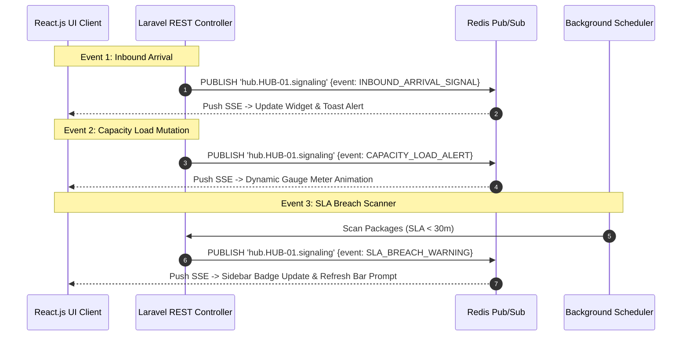

# 📄 Feature FRD: F-05 Event-Driven Real-Time SSE Signaling Engine

---

### 1. Deskripsi Fitur
Fitur **Event-Driven Real-Time SSE Signaling Engine** menyediakan mekanisme push notification dan pembaruan antarmuka secara otomatis tanpa *reload* browser (*Server-Sent Events* / SSE via Laravel `StreamedResponse`). Fitur ini bertindak sebagai bus sinyal utama yang menghubungkan seluruh pemicu transaksi (*Inbound ACK*, *Bulk Generation*, *Outbound Departure*, dan *Background SLA Scan*) langsung ke antarmuka Admin Hub secara *real-time*.

---

### 2. Aturan Bisnis Terkait (Business Rules)
* **`BR-05.1` Channel Isolation**: Setiap koneksi SSE dipublikasikan secara terisolasi ke channel Redis `hub.{hub_id}.signaling`, sehingga notifikasi hanya diterima oleh Admin yang bertugas di Hub bersangkutan.
* **`BR-05.2` Instant Event Mutation**: Notifikasi dipancarkan secara instan (<1 detik) setelah transaksi database terkait diselesaikan (*post-commit hook*).
* **`BR-05.3` Auto-Reconnect & Handshake**: Frontend React.js menggunakan `EventSource API` dengan mekanisme *reconnect* otomatis jika terjadi fluktuasi koneksi jaringan.

---

### 3. Spesifikasi 3 Event Utama SSE & Payload Contract

#### **3.1. Event 1: `INBOUND_ARRIVAL_SIGNAL`**
* **Trigger (Pemicu)**: Ketika *Manifest Data Generator* (F-02) mengeksekusi *bulk insert* atau truk/manifes baru dijadwalkan masuk menuju hub destinasi.
* **Target Halaman**: Halaman *Inbound Sorting* (F-06) dan *Sidebar Menu*.
* **Payload JSON Contract**:
  ```json
  {
    "event": "INBOUND_ARRIVAL_SIGNAL",
    "data": {
      "hub_id": "HUB-JKS-01",
      "manifest_code": "MNF-2609-0012",
      "new_trucks_count": 1,
      "timestamp": "2026-09-22T10:45:00Z",
      "message": "Truk Baru Tiba di Hub. Segera periksa daftar manifest."
    }
  }
  ```
* **Reaksi UI (Frontend Handling)**:
  * Angka indikator pada Widget *"Truk Pengirim Masuk"* di Halaman *Inbound Sorting* bertambah secara *real-time*.
  * Muncul *Toast Notification*: **"Truk Baru Tiba di Hub. Segera periksa daftar manifest."**

#### **3.2. Event 2: `CAPACITY_LOAD_ALERT`**
* **Trigger (Pemicu)**: Ketika truk/manifes di-ACK (diterima) di F-06 (menambah beban *In Hub*), ATAU ketika kurir/armada "Diberangkatkan" di F-04 (mengurangi beban *In Hub*).
* **Target Halaman**: Halaman *SLA Queue Dashboard* (F-03) ➔ Widget *Capacity Load Gauge Meter* (misal: `180/200`).
* **Payload JSON Contract**:
  ```json
  {
    "event": "CAPACITY_LOAD_ALERT",
    "data": {
      "hub_id": "HUB-JKS-01",
      "current_load": 180,
      "max_capacity": 200,
      "capacity_percentage": 90.0,
      "status_zone": "WARNING",
      "timestamp": "2026-09-22T10:45:00Z",
      "message": "Kapasitas Hub mencapai 90%."
    }
  }
  ```
* **Reaksi UI (Frontend Handling)**:
  * *Gauge Meter* (bar kapasitas) di halaman *SLA Queue* langsung bergerak secara *real-time* (naik atau turun) tanpa perlu *refresh*.
  * Jika persentase beban mencapai `> 90%`, kotak kuning *Capacity Warning Alert* otomatis muncul di layar.

#### **3.3. Event 3: `SLA_BREACH_WARNING`**
* **Trigger (Pemicu)**: *Background CronJob / Scheduler* yang mendeteksi adanya paket yang sisa waktunya bergeser di bawah 30 menit (`remaining_minutes < 30`, status Merah / Critical).
* **Target Halaman**: *Sidebar Menu* & Halaman *SLA Queue* (F-03).
* **Payload JSON Contract**:
  ```json
  {
    "event": "SLA_BREACH_WARNING",
    "data": {
      "hub_id": "HUB-JKS-01",
      "critical_packages_count": 24,
      "timestamp": "2026-09-22T10:45:00Z",
      "message": "Ada paket baru yang kritis. Segera Refresh Live Queue."
    }
  }
  ```
* **Reaksi UI (Frontend Handling)**:
  * Angka *badge* merah di sebelah menu *"SLA Queue"* pada *Sidebar* bertambah/berubah secara otomatis (misal dari 20 menjadi 24).
  * Muncul tombol/banner pemberitahuan di atas tabel SLA: **"Ada paket baru yang kritis. Segera Refresh Live Queue."** yang mengarahkan Admin untuk menekan tombol *Refresh Live Queue* di pojok kanan atas.

---

### 4. Sequence Diagram Flow Architecture



---

### 5. Acceptance Criteria
* [x] Sinyal `INBOUND_ARRIVAL_SIGNAL` memperbarui widget truk inbound & merender toast alert secara instan.
* [x] Sinyal `CAPACITY_LOAD_ALERT` menggerakkan gauge meter secara live saat ACK inbound atau Outbound dispatch terjadi.
* [x] Sinyal `SLA_BREACH_WARNING` memperbarui badge angka merah di sidebar dan memicu tombol saran refresh antrean.
* [x] Seluruh event SSE menggunakan header `Accept: text/event-stream` dan dikirim melalui channel Redis terisolasi per `hub_id`.
