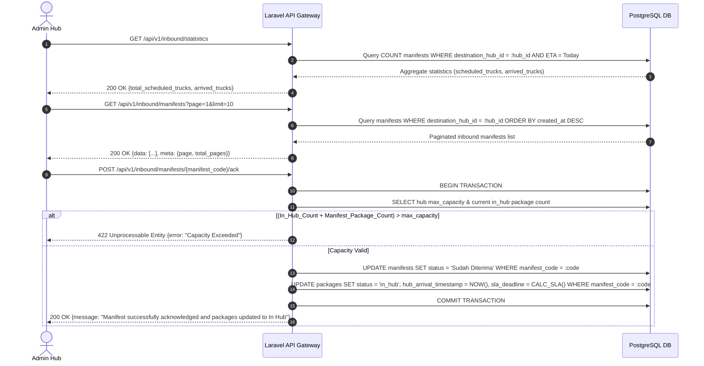

# 📄 Feature FRD: F-06 Inbound Sorting & Fleet Acknowledgment (ACK)

---

### 1. Deskripsi Fitur
Fitur **Inbound Sorting & Fleet Acknowledgment (ACK)** memfasilitasi proses konfirmasi penerimaan manifes/truk yang tiba di hub logistik secara transaksional. Admin hub dapat melihat statistik estimasi kedatangan armada harian, memantau daftar manifes *inbound*, serta mengeksekusi aksi **Terima & Konfirmasi (ACK)**.

Saat konfirmasi dieksekusi, sistem melakukan validasi gerbang kapasitas (*Rigid Capacity Check*), merubah status manifes menjadi `Sudah Diterima`, serta melakukan *bulk state update* pada seluruh paket di dalam manifes tersebut dari status `In Transit` menjadi `In Hub`, menyuntikkan timestamp kedatangan (`hub_arrival_timestamp`), dan mengkalkulasi batas waktu SLA (`sla_deadline`).

---

### 2. Sub-Fitur & Aturan Bisnis Terkait (Business Rules)

* **`BR-06.1` Inbound Manifest Acknowledgment (ACK) & State Mutation (Fungsi Inti)**:
  * **Rigid Capacity Check (Validasi Gerbang)**: Sebelum mutasi data terjadi, sistem wajib melakukan pengecekan kapasitas secara ketat: `(Total Paket In Hub Saat Ini + Total Paket dalam Manifes ini) <= max_capacity Hub`. Jika kalkulasi melebihi `max_capacity`, permintaan ditolak secara otomatis (*Throw Error: Capacity Exceeded / 422 Unprocessable Entity*).
  * **Manifest State Update**: Mengubah status di tabel `manifests` dari `Menunggu Konfirmasi` (atau `Dalam Perjalanan`) menjadi `Sudah Diterima`.
  * **Bulk Packages State Update**: Menjalankan *bulk update* transaksional (`DB::transaction`) pada seluruh paket di tabel `packages` yang terasosiasi dengan `manifest_code` tersebut:
    * Mengubah status paket dari `In Transit` menjadi `In Hub`.
    * Menyuntikkan timestamp saat ini (`NOW()`) ke kolom `hub_arrival_timestamp`.
    * Mengkalkulasi dan mengisi kolom `sla_deadline` berdasarkan `hub_arrival_timestamp` + durasi SLA sesuai jenis layanan paket (`Same Day`, `Next Day`, atau `Regular`).

* **`BR-06.2` Inbound Fleet Retrieval & Pagination (Tabel Manifes Inbound)**:
  * Memuat daftar armada/manifes yang menuju atau sudah tiba di hub tempat admin bertugas dengan kueri filter `destination_hub_id = {current_admin_hub_id}`.
  * Hanya menampilkan manifes berstatus *Inbound* (`Dalam Perjalanan`, `Menunggu Konfirmasi`, dan `Sudah Diterima`).
  * Data dimuat menggunakan mekanisme *pagination* (maksimal 10 baris per halaman, *limit 10, offset*) untuk efisiensi database.
  * **Dynamic Action Button**: Sistem merender tombol aksi secara dinamis sesuai status manifes:
    * **`Menunggu Konfirmasi`**: Merender tombol aksi aktif **"Terima & Konfirmasi"** (Warna Utama / Merah-Aksen).
    * **`Sudah Diterima`**: Merender teks pasif **"Diterima oleh Admin"** (Abu-abu / Disabled).
    * **`Dalam Perjalanan`**: Merender teks peringatan **"Menunggu Truk Tiba"** (Abu-abu / Disabled).

* **`BR-06.3` Daily Inbound Forecast & Statistic Widget (Widget Atas)**:
  * **Total Truk Terjadwal**: Menghitung (`COUNT`) seluruh manifes *inbound* untuk hub ini yang memiliki estimasi waktu kedatangan (ETA) pada hari berjalan (`00:00:00` s.d. `23:59:59`).
  * **Truk Tiba**: Menghitung jumlah manifes dari poin di atas yang statusnya sudah `Menunggu Konfirmasi` atau `Sudah Diterima`.

---

### 3. Alur Kerja & Spesifikasi API

#### **3.1. Flow Diagram**


#### **3.2. API Contract Specification**

* **1. Inbound Statistic Widget Endpoint**:
  * **Endpoint**: `GET /api/v1/inbound/statistics`
  * **Response Payload (200 OK)**:
    ```json
    {
      "status": "success",
      "data": {
        "today_date": "2026-09-22",
        "total_scheduled_trucks": 12,
        "arrived_trucks": 8,
        "pending_trucks": 4
      }
    }
    ```

* **2. Inbound Fleet List & Pagination Endpoint**:
  * **Endpoint**: `GET /api/v1/inbound/manifests?page=1&limit=10`
  * **Response Payload (200 OK)**:
    ```json
    {
      "status": "success",
      "data": [
        {
          "manifest_code": "MNF-2609-0012",
          "origin_hub_name": "Hub Jakarta Selatan",
          "vehicle_type": "Truk Engkel",
          "total_packages": 45,
          "eta": "2026-09-22T10:30:00Z",
          "status": "Menunggu Konfirmasi",
          "action_state": "CAN_ACKNOWLEDGE"
        },
        {
          "manifest_code": "MNF-2609-0010",
          "origin_hub_name": "Hub Bandung Central",
          "vehicle_type": "Truk Besar",
          "total_packages": 80,
          "eta": "2026-09-22T08:00:00Z",
          "status": "Sudah Diterima",
          "action_state": "ALREADY_ACCEPTED"
        },
        {
          "manifest_code": "MNF-2609-0015",
          "origin_hub_name": "Hub Surabaya Transit",
          "vehicle_type": "Truk Engkel",
          "total_packages": 35,
          "eta": "2026-09-22T16:00:00Z",
          "status": "Dalam Perjalanan",
          "action_state": "WAITING_ARRIVAL"
        }
      ],
      "meta": {
        "current_page": 1,
        "per_page": 10,
        "total_records": 3,
        "total_pages": 1
      }
    }
    ```

* **3. Inbound Manifest Acknowledgment (ACK) Endpoint**:
  * **Endpoint**: `POST /api/v1/inbound/manifests/{manifest_code}/ack`
  * **Response Success (200 OK)**:
    ```json
    {
      "status": "success",
      "message": "Manifest MNF-2609-0012 successfully acknowledged. 45 packages moved to In Hub status.",
      "data": {
        "manifest_code": "MNF-2609-0012",
        "status": "Sudah Diterima",
        "packages_updated": 45,
        "arrival_timestamp": "2026-09-22T07:45:00Z"
      }
    }
    ```
  * **Response Error Capacity Exceeded (422 Unprocessable Entity)**:
    ```json
    {
      "status": "error",
      "code": "CAPACITY_EXCEEDED",
      "message": "Gagal mengonfirmasi manifes: Total paket (180 paket di Hub + 45 paket di Manifes = 225) melebihi kapasitas maksimal Hub (200 paket)."
    }
    ```

---

### 4. Acceptance Criteria
* [x] Widget atas menampilkan jumlah tepat `Total Truk Terjadwal` dan `Truk Tiba` untuk hari berjalan.
* [x] Tabel manifes inbound hanya menampilkan data untuk `destination_hub_id` admin yang login dengan urutan pagination 10 baris per halaman.
* [x] Status tombol rendered dinamis: "Terima & Konfirmasi" untuk `Menunggu Konfirmasi`, "Diterima oleh Admin" (Disabled) untuk `Sudah Diterima`, "Menunggu Truk Tiba" (Disabled) untuk `Dalam Perjalanan`.
* [x] Mengeksekusi "Terima & Konfirmasi" melakukan pengecekan kapasitas (*Rigid Capacity Check*). Jika `Total In Hub + Paket Manifest > max_capacity`, request ditolak dengan error `CAPACITY_EXCEEDED`.
* [x] Jika kapasitas aman, sistem secara transaksional mengubah status manifes menjadi `Sudah Diterima`, memutasi seluruh paket di dalamnya dari `In Transit` menjadi `In Hub`, menyuntikkan `hub_arrival_timestamp`, dan mengkalkulasi `sla_deadline`.
